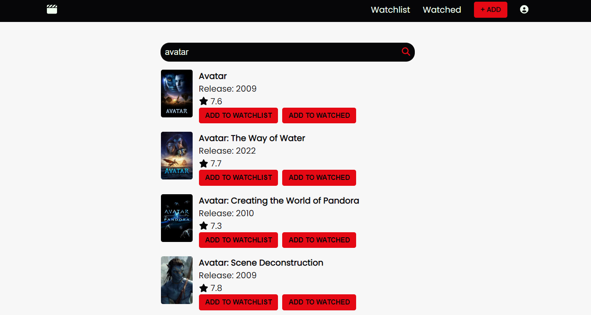
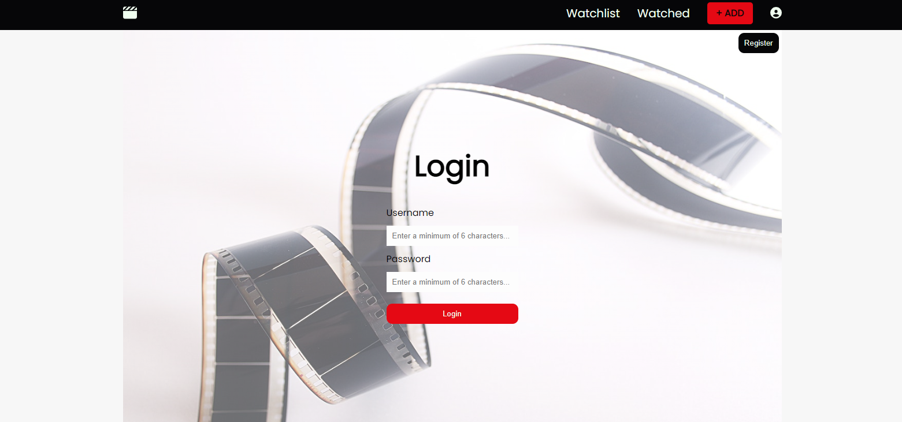
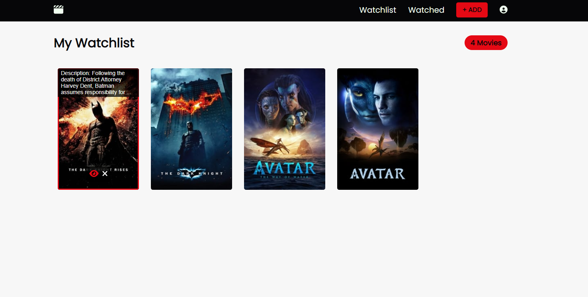
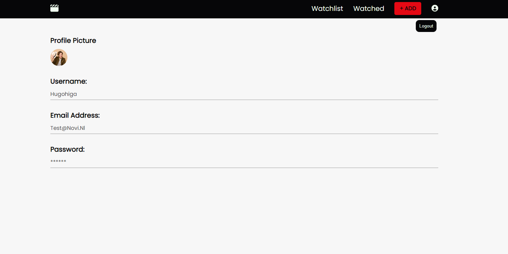

# Film watchlist applicatie frontend eindopdracht. 
Eindopdracht gemaakt voor de frontend leerlijn van NOVI hogeschool. 

## < Inhoudsopgave >
- Introductie
- Techstack
- API
- De applicatie
- Hoe run je de web applicatie?
- Hoe log je in? 

## < Introductie >
Ben je ook een enorme film fanaat? Maar kan je op het moment van kijken nooit op de
titel komen. Deze applicatie gaat je daarbij helpen doordat je zelf een kijklijst
kan maken waardoor je op een later moment altijd kan terugvinden welke films je wil
bekijken.

## < Techstack >
- HTML5
- CSS
- Javascript
- ReactJS

## < Gebruikte tools >
- Figma
- Webstorm

## < Gebuikte API >
- The Movie Database (TMBD): https://developers.themoviedb.org/3/getting-started/introduction

## < De web applicatie >
Via de start pagina kan je films zoeken en toevoegen aan je kijklijst of bekeken lijst.

Na registratie en inloggen kom je bij de watchlist.

Door met je muis over de poster in de watchlist te gaan kan je deze verwijderen, toevoegen aan watched of de volledige beschrijving lezen door hier met je muis op te klikken. 

## < Runnen van de applicatie >
1. Start je IDE
2. Open de terminal van je computer
3. Check of node geïnstalleerd door het commando: "node-v" te typen in de terminal
4. Als dit is geïnstalleerd > ga door naar stap 6
5. Als node niet is geïnstalleerd download het dan via deze link: https://nodejs.org/en/download/
6. Clone het project van github
7. Als het project is gecloned op je de terminal van je IDE
8. Typ: "npm install" in de terminal en druk op enter. Dit zal de benodigde npm packages installeren
9. Start daarna de applicatie door "npm run start" te typen. De applicatie zal draaien op http://localhost:3000/
10. Veel plezier met het maken van je film kijklijst! 

## < Hoe in te loggen >
De applicatie maakt gebruik van de NOVI backend die gebruikers na een uur verwijderd. Om in te loggen zul je een account moeten aanmaken die een gebruikersnaam e-mailadres en wachtwoord bevat. 
Je kan inloggen door op het profiel icoon te klikken rechtsboven in het scherm. 

Rechtsboven op de login pagina kan je klikken op de "register" knop waar je jezelf dient te registreren. Wanneer dit is gelukt zal de website je automatisch navigeren naar de login pagina. 

Veel plezier! :) 

